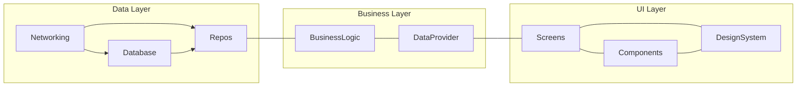

# Basic Architecture

A base for starting a fresh project with all essentials project structure. Basically, this structure consist on three layers. 

## Business Logic Layer

It is according to the state management selection. There are several state management for Flutter Project. 
[GETx](https://pub.dev/packages/get) is the most popular package on pub.dev. However, Flutter favorite state management is [Provider](https://pub.dev/packages/provider).
Also, another large group of experienced developers love [BLoC](https://bloclibrary.dev/#/) 