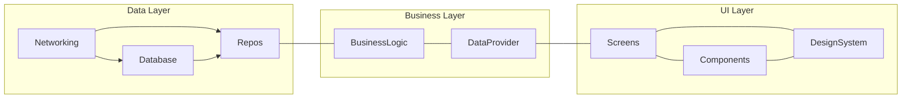

# Basic Architecture

A base for starting a fresh project with all essentials project structure. Basically, this structure consist on three layers. 

```mermaid
graph LR;
    subgraph Data Layer
        Networking --> Database
        Networking --> Repos
        Database --> Repos
    end
    Repos---BusinessLogic;
    BusinessLogic --- DataProvider;
    subgraph Business Layer
        BusinessLogic
        DataProvider
        end
    DataProvider --- Screens
    subgraph UI Layer
        Screens --- DesignSystem
        Screens --- Components
        Components --- DesignSystem
    end

```